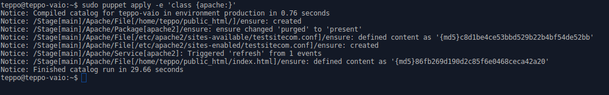
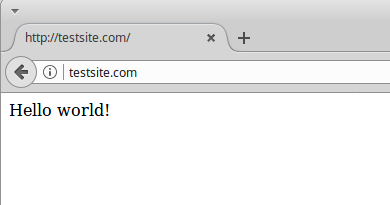
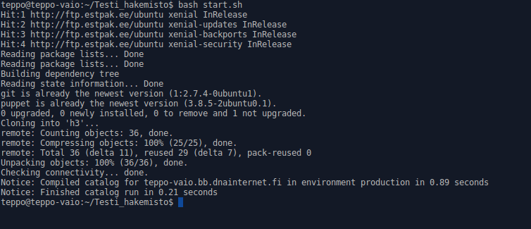

# h3

## Haaga-Helia, Palvelinten hallinta ict4tn022-2, uusi OPS - 5 op

Tehtävä h3:n toimeksianto löytyy osoitteesta http://terokarvinen.com/2017/aikataulu-%e2%80%93-palvelinten-hallinta-ict4tn022-2-%e2%80%93-5-op-uusi-ops-loppukevat-2017-p2. Se piti sisällään seuraavat kohdat:

*a) Package-File-Server. Asenna ja konfiguroi jokin demoni package-file-server -tyyliin. Tee jokin muu asetus kuin tunnilla näytetty sshd:n portin vaihto.*

*b) Modulit Gitistä. Tee skripti, jolla saat nopeasti modulisi kloonattua GitHubista ja ajettua vaikkapa liverompulle. Voit katsoa mallia terokarvinen/nukke GitHub-varastosta.*

*c) Vapaaehtoinen: Vaihda Apachen default VirtualHost Puppetilla siten, että sivut ovat jonkun kotihakemistossa ja niitä voi muokata normaalin käyttäjän oikeuksin.*

*d) Vapaaehtoinen vaikea: Konfiguroi jokin muu demoni (kuin Apache tai SSH) Puppetilla*

Tein kohdat a ja b.

Toteutin harjoituksen Sony Vaio VPCEA2S1E -kannettavalla, jossa Intel Core i3, 4 Gt RAM ja asennettu käyttöjärjestelmä Xubuntu 16.04.1 LTS "Xenial Xerus" - Release amd64.

Koneessa oli valmiiksi asennettuna Puppet ja Git. Mikäli niitä ei olisi ollut olisin asentanut ne seuraavasti:

        $ sudo apt-get update (päivitysten haku)

        $ sudo apt-get install puppet (puppetin asennus)

        $ sudo apt-get install git (gitin asennus)

## GitHub

Kirjauduin Firefox -selaimella GitHubiin ja loin uuden repositoryn h3. Määritin sen lisenssiksi GNU General Public License v3.0.

Kloonasin edellä mainitun repositoryn h3 terminaalissa komennolla:

         $ git clone https://github.com/teppoviljanen/h3.git

Kotihakemistooni ilmestyi hakemisto h3, jossa oli LICENSE ja README -nimiset tiedostot.
Loin tiedoston h3.md, jolla raportoin tämän tehtävän.

        $ nano h3.md

Tallensin tiedoston h3.md, jonka jälkeen annoin seuraavat komennot:

        $ git add .
        $ git commit

Annoin commitissa tiedostolle versionumeron 0.1. Tämän jälkeen annoin komennot

        $ git pull
        $ git push

Annoin käyttäjätunnukseni ja salasanani.

Kävin päivittämässä selaimessa GitHubin näytön ja totesin, että tiedosto h3.md näkyy GitHubissa.

## a) Puppet-moduli

Toteutin tehtävän asentamalla apache2:den ja konfiguroimalla siihen virtualhostin testsite.com. Samalla moduli luo testisivun sisällöllä 'Hello World!' virtualhostille.

Tein ensin tarvittavat hakemistot komennoilla:

	$ cd /etc/puppet/modules
	$ sudo mkdir apache
	$ cd apache
	$ sudo mkdir manifests
	$ sudo mkdir templates

Siirryin hakemistoon manifests ja loin tiedoston init.pp seuraavasti:

	$ cd manifests
	$ sudoedit init.pp

Rakensin init.pp -tiedoston pala kerrallaan ja aina yhden palan jälkeen testasin sen toiminnon. Lopullinen init.pp -tiedosto näyttää tältä:

	class apache {

		package {'apache2':
			ensure => 'installed',
		}

		file {'/etc/apache2/sites-available/testsitecom.conf':
			content => template('apache/testsitecom.conf.erb'),
		}

		file {'/etc/hosts':
			content => template('apache/hosts.erb'),
		}

		file {'/home/teppo/public_html/':
			ensure => 'directory',
		}

		file {'/home/teppo/public_html/index.html':
			content => 'Hello world!',
		}

		file { '/etc/apache2/sites-enabled/testsitecom.conf':
			ensure => link,
			target => '/etc/apache2/sites-available/testsitecom.conf',
			notify => Service['apache2'],	
		}

		service {'apache2':
			ensure => true,
			enable => true,
			require => Package['apache2'],
		} 
	}

Loin kaksi templatea hakemistoon /etc/puppet/modules/apache2/templates

Virtualhostin määrittäminen:

Loin templaten testsitecom.conf.erb

	$ sudoedit testsitecom.conf.erb

Edellä mainitun tiedoston sisältö:

	<VirtualHost *:80>

		ServerName testsite.com
		ServerAlias www.testsite.com

		DocumentRoot /home/teppo/public_html/

			<Directory /home/teppo/public_html/>
				Require all granted
			</Directory>

	</VirtualHost>

Hosts tiedoston muuttaminen:

	$ sudo cp /etc/hosts /etc/puppet/modules/apache/templates
	$ sudo mv hosts hosts.erb
	$ sudoedit hosts.erb

Lisäsin tiedostoon hosts.erb rivin 

127.0.0.1	testsite.com
 
Hosts.erb näyttää rivin lisäämisen jälkeen tältä:

	127.0.0.1	localhost
	127.0.1.1	teppo-vaio
	127.0.0.1	testsite.com
	
	# The following lines are desirable for IPv6 capable hosts
	::1     ip6-localhost ip6-loopback
	fe00::0 ip6-localnet
	ff00::0 ip6-mcastprefix
	ff02::1 ip6-allnodes
	ff02::2 ip6-allrouters

Lopuksi ajoin modulin

	$ sudo puppet apply -e 'class {apache:}'

Se meni läpi ilman virheilmoituksia

Testasin toimivuutta kirjoittamalla selaimen osoitekenttään testsite.com. Selaimeen aukesi modulin luoma index.html

Edellä kuvatun perusteella voidaan todeta, että moduli asensi onnistuneesti apachen ja konfiguroi virtualhostin.

### Kohdatut ongelmat

Ainoa ongelma modulia toteutettaessa oli, että miten saan modulissa korvattua komennon sudo a2ensite testsitecom.conf ja muodostettua symlinkin sites-available ja sites-enable hakemistojen välille. 
Löysin Googlen avulla ratkaisun sivulta adamcod.es.

### Lähteet:

https://adamcod.es/2016/04/08/introduction-to-puppet.html (kohdatun ongelman ratkaisu)

http://terokarvinen.com/2017/aikataulu-%e2%80%93-linux-palvelimet-ict4tn021-2-ti-ja-3-ke-alkukevat-2017-5-op (VirtualHostin luomisen opettaminen)

Lisäksi lähteenä on käytetty Tero Karvisen oppitunneilla opettamia asioita puppet modulista.

## b) Modulit Gitistä

Laadin bash-scriptin, jolla voi kloonata GitHubista kohdassa a laaditun modulin ja ajaa sen. Scriptin laatimisen esimerkkinä käytin Tero Karvisen oppitunnilla läpikäymää esimerkkiä.
Esimrkki löytyy osoitteesta https://github.com/terokarvinen/nukke.

Laadin suraavan bash-scriptin:

	sudo apt-get update
	sudo apt-get -y install puppet git
	git clone https://github.com/teppoviljanen/h3.git
	cd h3
	sudo puppet apply --modulepath puppet/modules/ -e 'class {apache:}'

Testasin scriptin toimivuutta ja laadin sitä varten kotihakemistooni uuden hakemiston Testi_hakemisto. Kopion kansiossa h3 olevan start.sh -tiedoston Testi_hakemistooon.
Ajoin start.sh -tiedoston. Käytin seuraavia komentoja

	$ cd
	$ mkdir Testi_hakemisto
	$ cd Testi_hakemisto
	$ cp /home/teppo/h3/start.sh /home/teppo/Testi_hakemisto
	$ bash start.sh

Scripti toimi. Ohessa kuvakaappaus, josta pystyy todentamaan, että kaikki scriptin kohdat on käyty onnistuneesti läpi.

Lopuksi latasin vielä hakemiston h3 muuttuneen sisällön GitHubiin komennoilla:

	$ git add .
	$ git commit
	$ git pull
	$ git push
